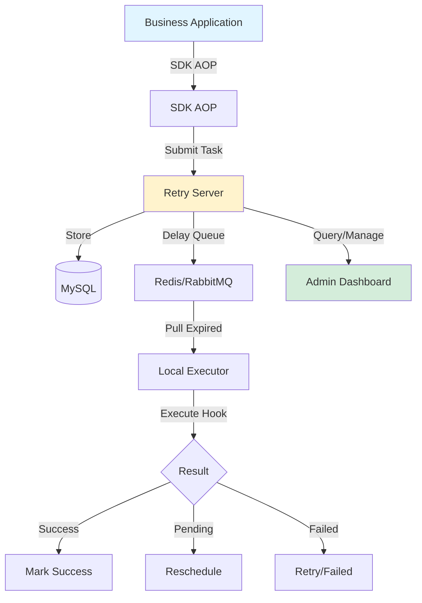
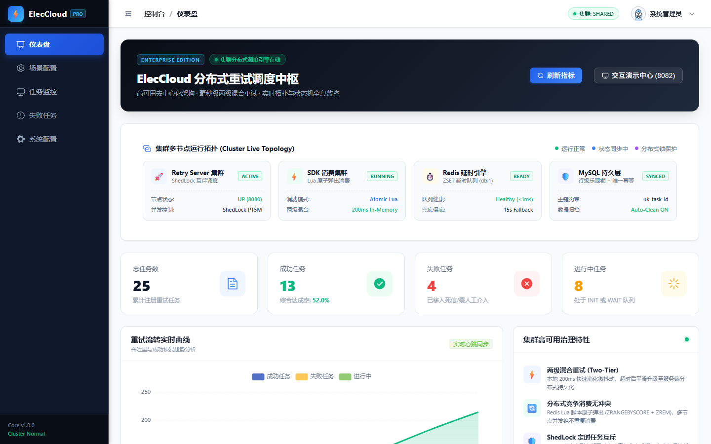
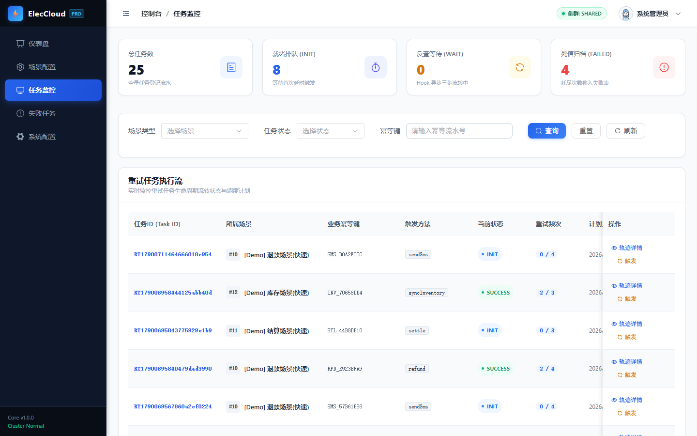
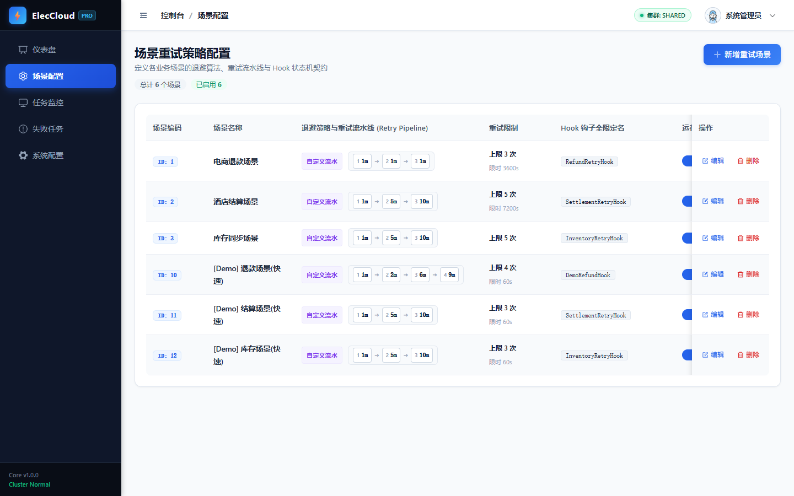

<div align="center">

# ⚡ ElecCloud

**The Easiest Distributed Retry Platform with Zero-Hook Mode**

[](https://openjdk.org/)
[](https://spring.io/projects/spring-boot)
[](LICENSE)
[](https://github.com/chaoking320/eleccloud)
[](CONTRIBUTING.md)

[English](README.md) | [简体中文](README_zh.md)

[Quick Start](#-quick-start) • [Features](#-features) • [Architecture](#-architecture) • [Documentation](#-documentation) • [Contributing](#-contributing)

</div>

---

## � The Origin Story

> **ElecCloud — The Electron Cloud**
>
> In quantum physics, electrons don't orbit the nucleus in fixed paths. Instead, they form a **probability cloud** around the nucleus — constantly in motion, tirelessly guarding the core from external interference.
>
> This is the philosophy behind ElecCloud: **When your critical services fail due to network jitters, downstream timeouts, or third-party unavailability, you shouldn't need manual intervention. Like an electron cloud, ElecCloud silently and persistently guards your business processes, ensuring tasks eventually succeed — no matter what.**

In distributed systems, cross-service failures are inevitable:

- 💳 Payment callback timeout → Fund status unknown, manual reconciliation needed
- 🌐 Third-party API rate limit → Batch requests lost, manual data entry required  
- 📨 Message delivery failure → Data inconsistency, tedious troubleshooting

These "force majeure" failures typically require **human intervention**, leading to high operational costs and delayed responses.

**ElecCloud's mission: Let failed tasks automatically retry until success, freeing engineers from repetitive firefighting.**

---

## �🎯 Why ElecCloud?

A production-ready distributed retry platform for Java microservices. **5 minutes to integrate, 80% scenarios covered with zero code.**

### vs. Traditional Solutions

| Feature | ElecCloud | Manual Retry | XXL-JOB | Spring Retry |
|---------|-----------|--------------|---------|--------------|
| **Zero-Hook Mode** | ✅ 5 min integration | ❌ Need code | ❌ Complex setup | ⚠️ Limited |
| **PRE_SUBMIT Mode** | ✅ Process crash safe | ❌ Data loss risk | ❌ Not supported | ❌ Not supported |
| **Visual Dashboard** | ✅ Real-time monitoring | ❌ Log only | ✅ Supported | ❌ No UI |
| **Fault Tolerance** | ✅ Multi-layer fallback | ❌ Single point | ⚠️ Redis dependent | ❌ In-memory |
| **Learning Curve** | 🟢 Very Low | 🟡 Medium | 🔴 High | 🟡 Medium |

## ✨ Core Features

### 🚀 Zero-Hook Mode (Game Changer!)

**Traditional Way** (50+ lines of code):
```java
@Component
public class PaymentRetryHook implements RetryHook {
    String checkStatus(...) { /* 20 lines */ }
    QueryResult doQuery(...) { /* 20 lines */ }
    void doCallback(...) { /* 10 lines */ }
}
```

**ElecCloud Way** (One annotation):
```java
@RetryableTask(sceneType = 1001, idempotentKey = "#orderId")
public void processPayment(String orderId) {
    paymentApi.pay(orderId);
    // That's it! Auto retry on failure ✅
}
```

### 💎 Production-Ready Features

| Feature | Description |
|---------|-------------|
| **🎯 PRE_SUBMIT Mode** | Submit task before execution - process crash safe |
| **🔄 4 Backoff Strategies** | CUSTOM, FIXED, LINEAR, EXPONENTIAL |
| **📊 Real-time Dashboard** | Task monitoring, Timeline view, Manual trigger |
| **🛡️ Multi-layer Fallback** | Redis → MySQL → ExecutingTimeoutScanner |
| **🔐 Security Built-in** | API Key authentication, IP whitelist |
| **📈 Prometheus Ready** | Full observability with Grafana dashboard |
| **⚡ High Performance** | 1000+ TPS per server node |
| **🌐 Standalone Mode** | Run without server (SDK-only mode) |

## 🚀 Quick Start

### 5-Minute Integration

**Step 1: Start Services (Docker)**

```bash
git clone https://github.com/chaoking320/eleccloud.git
cd eleccloud
docker compose -f docker-compose.simple.yml up -d
```

**Step 2: Add SDK Dependency**

```xml
<dependency>
    <groupId>com.retry.platform</groupId>
    <artifactId>retry-client-sdk</artifactId>
    <version>1.0.0</version>
</dependency>
```

**Step 3: Configure**

```yaml
retry:
  client:
    server-url: http://localhost:8080
    enabled: true
```

**Step 4: Add Annotation**

```java
@Service
public class OrderService {
    
    @RetryableTask(sceneType = 1001, idempotentKey = "#orderId")
    public void syncOrder(String orderId) {
        warehouseApi.sync(orderId);
        // Auto retry: 1min → 5min → 10min → 30min
    }
}
```

**Step 5: Open Dashboard**

Visit http://localhost:8081 to see your retry tasks!

> 📖 **Detailed Guide**: [QUICKSTART.md](QUICKSTART.md) | [Zero-Hook Mode Guide](docs/QUICK_START_ZERO_HOOK.md)

## 🏗️ Architecture

<div align="center">



</div>

### Core Components

| Component | Responsibility | Technology |
|-----------|---------------|------------|
| **retry-client-sdk** | AOP interception, local retry engine, Hook lifecycle | Spring AOP, Reflection |
| **retry-server** | Task persistence, scheduling, REST API | Spring Boot, MyBatis, Redis |
| **retry-admin** | Visual management, monitoring, manual trigger | Vue 3, Element Plus |
| **retry-example** | Integration examples, Hook templates | Spring Boot |

### Key Design Patterns

- **CAS Lock**: Database row-level lock for distributed safety
- **State Machine**: Hook lifecycle (checkStatus → doQuery → doCallback)
- **Fat/Slim Message**: Optimized for performance and compatibility
- **Multi-layer Fallback**: Redis failure → MySQL fallback → Timeout recovery

## 📚 Documentation

| Document | Description |
|----------|-------------|
| [Quick Start](QUICKSTART.md) | 5-minute integration guide |
| [Zero-Hook Mode](docs/QUICK_START_ZERO_HOOK.md) | 80% scenarios with zero code |
| [Hook Explained](docs/HOOK_EXPLAINED.md) | Custom Hook lifecycle guide |
| [SDK Guide](docs/SDK_GUIDE.md) | Complete SDK reference |
| [Architecture](docs/ARCHITECTURE.md) | System design and principles |
| [Docker Deployment](docs/QUICK_DOCKER_DEPLOY.md) | Production deployment guide |
| [Alert Guide](docs/ALERT_GUIDE.md) | Monitoring and alerting setup |
| [Contributing](CONTRIBUTING.md) | How to contribute |

## 🎨 Screenshots

<details>
<summary>Click to expand</summary>

### Dashboard Overview


### Task Monitoring


### Timeline View


### Scene Configuration


</details>

## 🤝 Contributing

We welcome contributions! Please see our [Contributing Guide](CONTRIBUTING.md) for details.

### Good First Issues

Look for issues tagged with [`good first issue`](../../issues?q=label%3A%22good+first+issue%22) - perfect for newcomers!

### Development

```bash
# Clone the repository
git clone https://github.com/chaoking320/eleccloud.git

# Build
mvn clean install

# Run tests
mvn test

# Start local environment
docker compose -f docker-compose.simple.yml up -d
```

## 📊 Performance

- **Throughput**: 1000+ TPS per server node
- **Latency**: P99 < 50ms (task submission)
- **Scalability**: Horizontal scaling with load balancer
- **Reliability**: 99.9% availability with proper setup

## 🌟 Roadmap

- [ ] **v1.1**: English documentation and UI i18n
- [ ] **v1.2**: PostgreSQL support
- [ ] **v1.3**: Kubernetes Operator
- [ ] **v2.0**: WebSocket real-time updates
- [ ] **v2.1**: Multi-tenant support

## 💬 Community

- **GitHub Issues**: [Bug reports and feature requests](../../issues)
- **GitHub Discussions**: [Q&A and discussions](../../discussions)
- **WeChat Group**: Scan QR code in [Community Guide](docs/COMMUNITY.md)

## 📄 License

This project is licensed under the Apache License 2.0 - see the [LICENSE](LICENSE) file for details.

## 🙏 Acknowledgments

Thanks to all contributors who have helped make ElecCloud better!

<a href="../../graphs/contributors">
  
</a>

---

<div align="center">

**If ElecCloud helps you, please give it a ⭐️ Star!**

Made with ❤️ by the ElecCloud community

</div>
