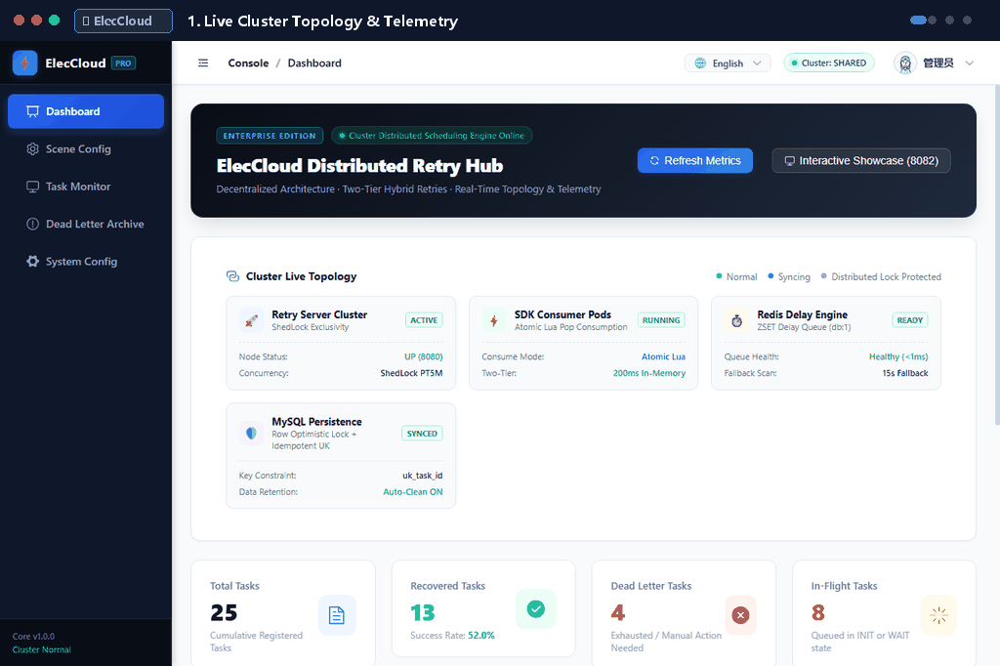
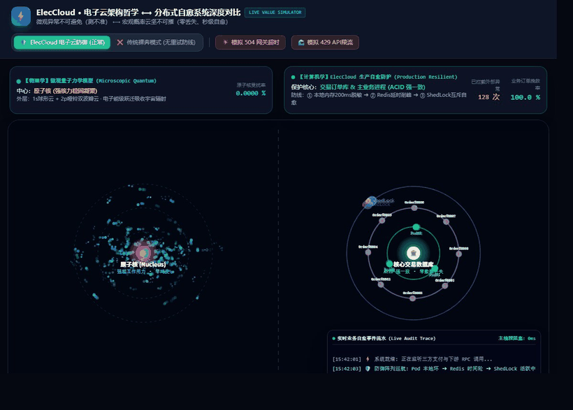
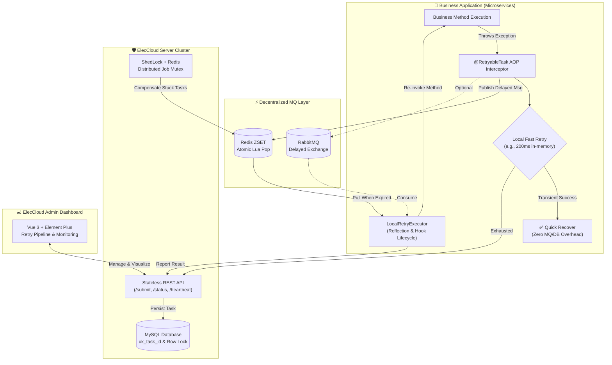

<div align="center">

# ⚡ ElecCloud

**A Lightweight, Decentralized Distributed Retry Framework for Java**

*Designed specifically for environments with one-directional network constraints, zero-callback coupling, and crash-resilient retry semantics.*

[](https://openjdk.org/)
[](https://spring.io/projects/spring-boot)
[](LICENSE)
[](https://github.com/chaoking320/eleccloud)
[](CONTRIBUTING.md)

[English](README.md) | [简体中文](README_zh.md)

[Quick Start](#-quick-start) • [Design Focus](#-design-focus--where-it-fits) • [Core Capabilities](#-core-capabilities) • [Architecture](#-architecture) • [Documentation](#-documentation) • [Contributing](#-contributing)

</div>

<p align="center">
  
</p>

---

## 🌌 The Origin Story: From Quantum Mechanics to Distributed Resilience

<p align="center">
  
</p>

<p align="center">
  <a href="docs/simulation.html">
    
  </a>
</p>

> **Why the name ElecCloud (Electron Cloud)?**
>
> In quantum mechanics, an individual electron's trajectory cannot be precisely predicted (Heisenberg's Uncertainty Principle — just like unpredictable network glitches and third-party timeouts in distributed environments). Yet macroscopically, the electron **probability cloud** forms an impenetrable shield guarding the atomic nucleus against external cosmic rays.
>
> **ElecCloud is the "Electron Cloud Defense Layer" for your critical systems**: Microscopic failures are inevitable; macroscopic business resilience is guaranteed!

### 🛡️ Why ElecCloud? At a Glance

| Critical Production Pain Points | ❌ Without Defense (No Retry / Naive Loop) | 🛡️ With ElecCloud Resilience |
| :--- | :--- | :--- |
| **Transient 504 Gateway Timeout** | Exhausts thread pools, cascades into system-wide outage, lost revenue | **Non-blocking Offload**: 200ms fast pod retry, auto-promotes to Redis delay queue, 0ms main thread blocking |
| **Third-party 429 Rate Limits** | Immediate tight loops aggravate downstream throttling storms | **Exponential Backoff & Jitter**: Smooth traffic dispersion and eventual self-healing |
| **Multi-node Cluster Conflicts** | Multiple pods simultaneously retry same transaction, risk double-spend | **ShedLock Mutex Ring**: Global distributed lock ensures strictly idempotent execution |
| **Integration Complexity** | Hundreds of lines of boilerplate try-catch, MQ topics, and cron jobs | **Zero-Intrusion**: Simply add `@RetryableTask(sceneType = 1001)` |

In distributed systems, transient failures are inevitable:

- 💳 Payment callback timeouts → Unconfirmed transaction state requiring manual reconciliation
- 🌐 Third-party API rate limits → Dropped requests requiring manual backfilling
- 📨 Message delivery blips → Temporary data inconsistency

---

## ⚙️ Compatibility & Runtime Requirements

ElecCloud is intentionally built with an **enterprise-first compatibility strategy**:

| Component | Target Version | Design Rationale |
|:---|:---|:---|
| **Java Runtime** | **JDK 17 / 21 (LTS)** | Built for modern JVMs, leveraging contemporary memory models and execution performance. |
| **Spring Framework** | **Spring Boot 2.7.x** | Prioritizes seamless integration with the vast ecosystem of existing production enterprise services without forcing an invasive migration to the `jakarta.*` namespace. |
| **Database** | **MySQL 8.0+** | Utilizes atomic status CAS transitions and indexed idempotent constraints. |
| **Message Queues** | **Redis 6+ (ZSET) / RabbitMQ 3.8+** | Dual-engine support for lightweight local setups or robust enterprise messaging. |

---

## 🎯 Design Focus & Where It Fits

ElecCloud does not try to be an all-in-one scheduler. Instead, it focuses on solving a few specific architectural pain points often encountered with retry solutions:

### Trade-offs & Comparisons

- **vs. Spring Retry**: Spring Retry is great for in-memory immediate retries, but loses state upon process crashes and risks thread exhaustion during prolonged outages. ElecCloud bridges both paradigms with **Two-Tier Hybrid Retry**: fast in-memory retries for transient blips, seamlessly escalating to persistent distributed retries when fast attempts are exhausted.
- **vs. XXL-JOB / ElasticJob**: Distributed job schedulers are the industry standard for cron-based batch computing. But setting up dedicated job handlers for individual method-level transient errors can be heavyweight. ElecCloud provides lightweight annotation-driven method retries.
- **vs. Centralized Retry Platforms**: Traditional platforms require the server to call back into your application via HTTP. This demands bidirectional network connectivity, which often breaks across VPCs, Kubernetes clusters, or private network boundaries. ElecCloud shifts the execution loop to the client SDK, making the server a simple, passive storage node.

| Scenario / Trait | Spring Retry | Traditional Distributed Schedulers | Centralized HTTP Retry Centers | ElecCloud |
| :--- | :--- | :--- | :--- | :--- |
| **Primary Focus** | In-memory retry | Scheduled batch jobs | Centralized HTTP callbacks | Asynchronous method retries |
| **Crash Safety** | ❌ Memory lost | ✅ Yes | ✅ Yes | ✅ `PRE_SUBMIT` mode |
| **Two-Tier (Fast + Slow)** | ❌ Only local in-memory | ❌ Only slow batch | ❌ Only slow remote | ✅ **Native Two-Tier Hybrid** |
| **Network Boundary** | Local JVM | Bidirectional / Agent | Bidirectional HTTP required | **One-directional only (SDK → Server)** |
| **Callback Coupling** | None | Agent required | Server needs business IP:port | **Zero (SDK pulls & executes locally)** |
| **Setup Overhead** | Minimal | Medium - High | Medium | Low |

---

## ✨ Core Capabilities

### 1. Decentralized Execution (No Reverse Callbacks)
Traditional retry platforms require the server to make HTTP requests back into your service. In cloud environments with ingress restrictions or dynamic containers, this is notoriously difficult to maintain. ElecCloud delegates scheduling to the SDK via MQ delayed queues, eliminating reverse connectivity requirements entirely.

### 2. Two-Tier Hybrid Retry (Fast Local + Persistent Distributed)
Avoid write amplification and latency penalty for transient micro-glitches (e.g., 50ms socket resets). With `localRetryTimes` and `localIntervalMs`, ElecCloud attempts immediate lightweight local retries first. If recovered, the method returns normally with **zero DB, Redis, or MQ overhead**. Only when local retries are exhausted does it seamlessly escalate to distributed delayed scheduling:

```java
@RetryableTask(
    sceneType = 1001,
    idempotentKey = "#orderId",
    localRetryTimes = 2,      // Tier 1: Fast local retry (2 attempts)
    localIntervalMs = 200     // 200ms interval (avoids MQ/DB write amplification)
    // Tier 2: Escalates automatically to distributed retry if local attempts fail
)
public void processPayment(String orderId) {
    paymentApi.pay(orderId);
}
```

### 3. Zero-Hook Mode for Common Cases
For scenarios that simply succeed if no exception is thrown (e.g., inventory sync, cache evictions, notifications), you don't need to write custom query hooks:

```java
@RetryableTask(sceneType = 1001, idempotentKey = "#orderId")
public void syncOrder(String orderId) {
    orderSyncApi.sync(orderId);
    // Automatically retried on exception using configured scene backoff
}
```

### 4. Crash Resilient (PRE_SUBMIT Mode)
If a process crashes while executing a task, traditional post-fail interceptors lose the trigger. In `PRE_SUBMIT` mode, the task is recorded in `INIT` state before execution begins, ensuring recovery if the JVM terminates abruptly.

### 4. Pragmatic Enterprise Features
- **4 Backoff Strategies**: `CUSTOM`, `FIXED`, `LINEAR`, `EXPONENTIAL`
- **Multi-layer Fallback**: Delayed Queue → Database fallback scanner → Executing timeout recovery
- **Concurrency Protection**: CAS status transitions and idempotent key unique constraints
- **Standalone Mode**: SDK-only mode without server dependency for simpler setups

---

## 🚀 Quick Start

### Option 1: Docker Compose (Recommended)

```bash
git clone https://github.com/chaoking320/eleccloud.git
cd eleccloud
docker compose -f docker-compose.simple.yml up -d
```

| Service | URL |
|---------|-----|
| Retry Server | http://localhost:8080 |
| Admin Dashboard | http://localhost:8081 |
| Demo App | http://localhost:8082 |

### Option 2: SDK Dependency (Remote Mode)

> 💡 **Quick evaluation**: Run `mvn clean install -DskipTests` at the project root once to install `retry-client-sdk` into your local `.m2` repository before adding the dependency below.

**Step 1: Add dependency**

```xml
<dependency>
    <groupId>com.retry.platform</groupId>
    <artifactId>retry-client-sdk</artifactId>
    <version>1.0.0</version>
</dependency>
```

**Step 2: Configure**

```yaml
retry:
  client:
    server-url: http://localhost:8080  # retry-server address
    enabled: true
    mq-type: REDIS                      # REDIS or RABBITMQ
    queue-name: my-service.retry        # per-service queue for isolation
```

**Step 3: Add annotation**

```java
@Service
public class OrderService {

    @RetryableTask(sceneType = 1001, idempotentKey = "#orderId")
    public void syncOrder(String orderId) {
        warehouseApi.sync(orderId);
        // Auto retry: 1min → 5min → 10min → 30min
    }
}
```

### Option 3: Standalone Mode (Zero Infrastructure)

No server, no Redis, no RabbitMQ needed — tasks persist in your own database.

```yaml
retry:
  client:
    mode: standalone
    scenes:
      - scene-type: 1001
        max-retry-count: 4
        retry-intervals: "1,5,10,30"
```

> 📖 **Full guides**: [QUICKSTART.md](QUICKSTART.md) | [Zero-Hook Guide](docs/QUICK_START_ZERO_HOOK.md) | [SDK Guide](docs/SDK_GUIDE.md)

---

## 🏗️ Architecture

ElecCloud adopts a **decentralized MQ-SDK-driven** architecture — scheduling authority is fully delegated to the SDK, eliminating the need for the server to actively call back into business services.



### Core Components

| Component | Responsibility | Technology |
|-----------|---------------|------------|
| **retry-client-sdk** | AOP interception, local state machine, Hook lifecycle | Spring AOP, Reflection, MyBatis |
| **retry-server** | Task persistence, REST API (data store only) | Spring Boot, MyBatis, Redis |
| **retry-admin** | Visual management, monitoring, manual trigger | Vue 3, Element Plus |
| **retry-example** | Integration examples, Hook templates | Spring Boot |

### Key Design Patterns

- **CAS Atomic Claim**: `UPDATE ... WHERE status IN ('INIT','WAIT')` — distributed mutex without locks
- **3-Phase Hook State Machine**: `checkStatus` → `doQuery` → `doCallback`
- **Fat Message**: Full execution context carried in MQ message — reduces HTTP round trips
- **Multi-layer Fallback**: MQ failure → DB scan fallback → ExecutingTimeout recovery

---

## 📚 Documentation

| Document | Description |
|----------|-------------|
| [Architecture](docs/ARCHITECTURE.md) | System design, state machine, ER diagram |
| [SDK Guide](docs/SDK_GUIDE.md) | Complete SDK reference & all configuration options |
| [Testing Guide](docs/TEST_GUIDE.md) | 5-minute hands-on testing walkthrough (refund, SMS, points) |
| [Hook Explained](docs/HOOK_EXPLAINED.md) | Custom Hook lifecycle guide (checkStatus → doQuery → doCallback) |
| [Deployment Guide](docs/QUICK_DOCKER_DEPLOY.md) | Docker Compose, bare-metal JAR deployment, Prometheus + Grafana |
| [Security](docs/SECURITY.md) | API Key auth, best practices |
| [Alert Guide](docs/ALERT_GUIDE.md) | Email, DingTalk, WeChat Work alerting setup |
| [Contributing](CONTRIBUTING.md) | How to contribute |

---

## 🤝 Contributing

We welcome contributions! Please see our [Contributing Guide](CONTRIBUTING.md) for details.

```bash
# Clone the repository
git clone https://github.com/chaoking320/eleccloud.git

# Build
mvn clean install -DskipTests

# Run tests
mvn test

# Start local environment
docker compose -f docker-compose.simple.yml up -d
```

Look for issues tagged [`good first issue`](../../issues?q=label%3A%22good+first+issue%22) — perfect for newcomers!

---

## 💬 Community & Feedback

ElecCloud is an active open-source project initiated and maintained by [@chaoking320](https://github.com/chaoking320).
Feedback, bug reports, and pull requests are warmly welcomed:

- **GitHub Issues**: [Bug reports and feature requests](../../issues)
- **GitHub Discussions**: [Q&A and architectural discussions](../../discussions)

---

## 📄 License

This project is licensed under the Apache License 2.0 — see the [LICENSE](LICENSE) file for details.

---

<div align="center">

**If ElecCloud helps you in your projects, please consider giving it a ⭐️ Star!**

Crafted with care by the ElecCloud maintainers & contributors

</div>
