# Design Document (v2)

> 基于远程 HTTP 回调架构的重构版本
> 对应 commit: `adf6838`

## Overview

分布式重试平台是一个基于 Java + Spring Boot 的通用异步重试中间件，采用微服务架构设计。系统由四个模块组成：

| 模块 | 端口 | 职责 | 技术栈 |
|------|------|------|--------|
| **retry-server** | 8080 | 任务调度、执行引擎、状态管理、延时队列 | Spring Boot 2.7 + MySQL + Redis + Redisson |
| **retry-client-sdk** | 嵌入应用 | 注解 AOP 接入 + HTTP 回调端点 + Hook 接口定义 | Spring Boot Starter (零外部依赖) |
| **retry-admin** | 8081 | 场景配置 CRUD、任务监控、失败任务管理、仪表盘 | Vue 3 + Element Plus + Spring Boot |
| **retry-example** | 8082 | 退款/结算场景示例应用 | Spring Boot + retry-client-sdk |

核心设计理念：
- **远程回调**：服务端不直接执行业务代码，通过 HTTP 回调客户端 SDK 端点，实现完整解耦
- **ZSET 延时队列**：Redis ZSET 实现精确到毫秒的任务调度
- **双重保障**：Redis ZSET 做主调度 + 定时 DB 扫描做兜底，防止任务丢失
- **场景驱动**：不同业务场景独立配置重试策略和回调地址

---

## 新旧架构对比

### 旧架构问题（本地反射模式）

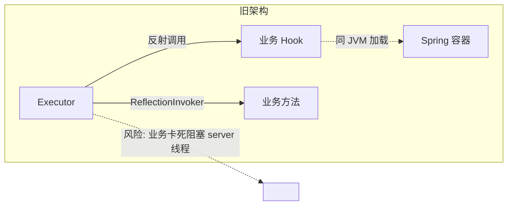

| 问题 | 影响 |
|------|------|
| 业务代码必须在 server classpath 上 | 部署耦合，无法独立扩缩容 |
| 反射加载任意 class | 安全隐患 |
| 业务方法卡死阻塞 server 线程 | 无隔离，影响其他任务 |
| 业务必须与 server 同框架 | 多语言扩展受限 |
| Hook 在 server 包 | 业务方无法独立维护 |
| 无 Metrics | 黑盒运行，无法观测 |

### 新架构优势（远程 HTTP 回调）

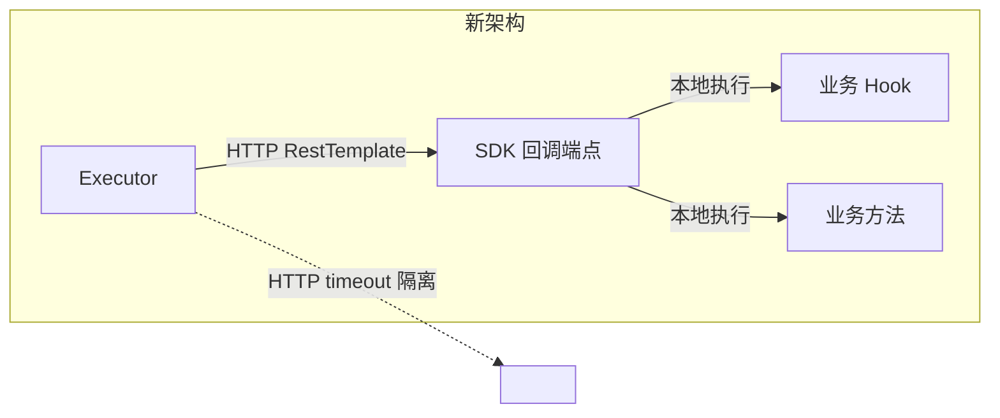

| 改进 | 收益 |
|------|------|
| HTTP 调用替代反射 | 完全解耦，server 不依赖任何业务代码 |
| Hook 迁到 client-sdk | 职责清晰，业务方拥有和控制 |
| HTTP timeout | 隔离业务故障，不阻塞 server |
| RestTemplate | 任何语言/框架都可对接 |
| Micrometer 埋点 | 场景粒度可观测 |

---

## 系统架构

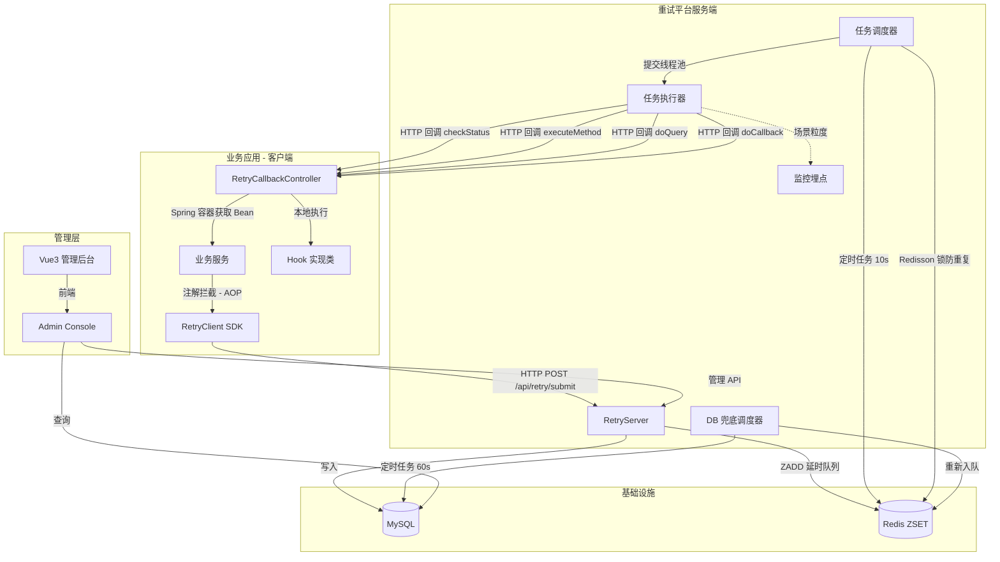

---

## 模块架构

### 1. retry-client-sdk (嵌入业务应用)

```
retry-client-sdk/
├── annotation/
│   └── @RetryableTask          # 注解：sceneType, idempotentKey, async, throwException
├── aspect/
│   └── RetryableTaskAspect     # AOP 环绕通知：捕获异常 → 提交任务
├── callback/
│   └── RetryCallbackController # 4个 HTTP 端点，供服务端远程回调
├── hook/
│   ├── RetryHook               # 接口：checkStatus / doQuery / doCallback
│   ├── RetryContext            # 上下文：taskId, sceneType, params, retryCount
│   └── QueryResult             # 查询结果
├── api/
│   └── RetryClient             # 接口：submit / cancel / queryTask
├── config/
│   └── RetryClientProperties   # 配置：server-url, enabled, dev-mode, timeout
├── dto/
│   ├── RetryTaskRequest        # 提交请求 DTO
│   └── RetryTaskDTO            # 任务详情 DTO
└── util/
    ├── JsonUtil                # FastJSON2 序列化
    └── ParameterExtractor      # AOP 参数提取（修复编译参数名丢失）
```

#### SDK 接入方式

**方式一：注解（推荐）**
```java
@RetryableTask(sceneType = 1, idempotentKey = "#orderId")
public boolean refund(String orderId, Double amount) { ... }
```

**方式二：手动 API**
```java
@Autowired
private RetryClient retryClient;

retryClient.submit(new RetryTaskRequest()
    .sceneType(1)
    .idempotentKey("order-001")
    .methodClass("com.example.RefundService")
    .methodName("refund")
    .methodParams("{\"amount\":100}"));
```

#### SDK 内部处理流程

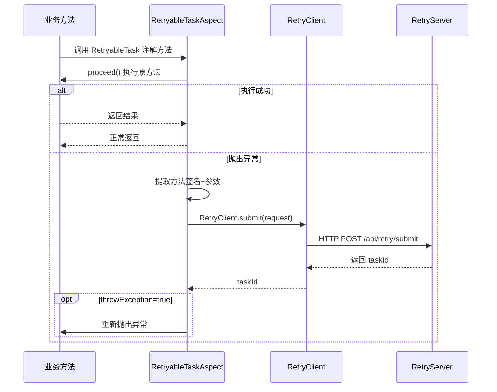

#### HTTP 回调端点（4个）

| 端点 | 用途 | 调用时机 |
|------|------|----------|
| `POST /api/retry/callback/check-status` | 检查业务状态 | 每次执行前 |
| `POST /api/retry/callback/execute-method` | 远程执行业务方法 | INIT 状态时 |
| `POST /api/retry/callback/query` | 主动查询第三方 | WAIT 状态时 |
| `POST /api/retry/callback/do-callback` | 执行回调收尾 | WAIT + 查询成功后 |

#### Hook 接口契约

```java
public interface RetryHook {
    // 返回: "INIT" / "WAIT" / "SUCCESS"
    String checkStatus(RetryContext context);
    
    // 主动查询第三方远程服务
    QueryResult doQuery(RetryContext context);
    
    // 成功后执行回调（如更新本地状态）
    void doCallback(RetryContext context, QueryResult result);
}
```

业务方通过实现此接口定义"轮询逻辑"——这是平台的核心价值所在（模式B：轮询重试）。

---

### 2. retry-server (核心服务端)

```
retry-server/
├── RetryServerApplication.java     # @SpringBootApplication + @EnableScheduling
├── config/
│   ├── RedissonConfig.java         # RedissonClient (分布式锁)
│   └── ExecutorConfig.java         # ThreadPoolTaskExecutor (核心10/最大50)
├── entity/
│   ├── RetryTask.java              # 重试任务实体
│   ├── RetryHistory.java           # 重试历史实体
│   ├── SceneConfig.java            # 场景配置（含 clientAppUrl）
│   └── FailedTask.java             # 失败任务实体
├── mapper/  (MyBatis XML)
│   ├── RetryTaskMapper.java/xml     # 任务 CRUD + 条件分页
│   ├── RetryHistoryMapper.java/xml  # 历史记录
│   ├── SceneConfigMapper.java/xml   # 场景配置 CRUD
│   └── FailedTaskMapper.java/xml    # 失败任务
├── service/
│   ├── RetryTaskService             # 创建/查询/更新状态/记录历史
│   ├── SceneConfigService           # 三级缓存 (local→redis→db)
│   ├── DelayQueueService            # Redis ZSET 延时队列 + DB 降级
│   ├── RetryControlService          # 重试控制 (间隔计算/超限判断)
│   └── FailedTaskService            # 失败任务管理
├── executor/
│   └── RetryTaskExecutor            # 核心执行器（HTTP 回调模式）
├── scheduler/
│   ├── RetryTaskScheduler           # 主调度器 (@Scheduled 10s)
│   └── DatabaseFallbackScheduler    # DB 兜底调度器 (@Scheduled 60s)
├── exception/
│   ├── BusinessException            # 业务异常 → 继续重试
│   ├── SystemException              # 系统异常 → 告警
│   ├── ConfigException              # 配置异常 → 标记失败
│   └── RetryExceptionHandler        # 异常分类处理器
└── metrics/
    └── RetryMetrics                 # Micrometer 埋点
```

#### 三级缓存（场景配置）

```
本地缓存 (ConcurrentHashMap)
    → 命中？返回
    → 未命中？查 Redis
Redis 缓存 (key=retry:scene:config:{sceneType}, TTL=1h)
    → 命中？返回+写本地
    → 未命中？查 DB
MySQL
    → 返回+写 Redis+写本地
```

启动时 `@PostConstruct` 全量加载已启用配置。

#### 分布式锁（两级）

```
调度器锁: Redisson lock("retry:scheduler:lock")
    → 防止多节点重复扫描
任务级锁: Redisson lock("retry:task:lock:{taskId}")  
    → 防止同一任务被多线程执行
```

---

### 3. retry-admin (管理后台)

| 页面 | 路由 | 核心功能 |
|------|------|----------|
| **仪表盘** | `/dashboard` | 统计卡片 + ECharts 趋势图 |
| **场景配置** | `/scene` | CRUD + 间隔可视化配置 + 客户端 URL 设置 |
| **任务监控** | `/task` | 筛选/分页 + 详情弹窗 + 执行轨迹时间轴 + 手动重试 |
| **失败任务** | `/failed` | 失败列表 + 一键恢复（重新入队）+ 删除 |
| **系统配置** | `/system` | 预留占位 |

管理后台 API：

| 模块 | 接口 | 说明 |
|------|------|------|
| **场景** | `GET/POST/PUT/DELETE /api/scene/*` | 场景 CRUD + 启用/禁用 |
| **任务** | `GET /api/task/list` | 条件分页查询 |
| | `GET /api/task/{taskId}` | 任务详情 |
| | `GET /api/task/{taskId}/history` | 执行历史 |
| | `GET /api/task/stats` | 统计数据 |
| | `POST /api/task/{taskId}/retry` | 手动重试 |
| **失败** | `GET /api/failed/list` | 失败任务列表 |
| | `POST /api/failed/{taskId}/recover` | 恢复入队 |
| | `DELETE /api/failed/{taskId}` | 删除归档 |

---

## 任务生命周期

### 状态机

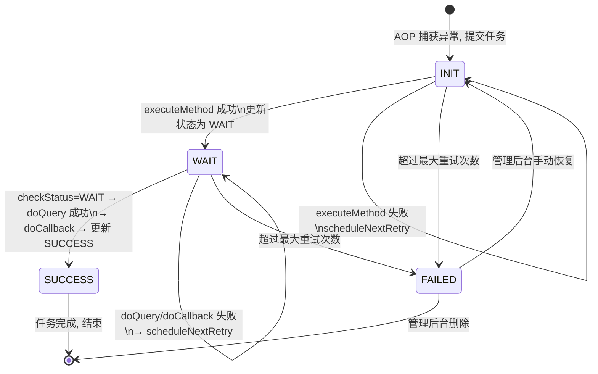

### 状态说明

| 状态 | 含义 | 触发条件 |
|------|------|----------|
| **INIT** | 初始化 | 任务刚创建，等待首次执行 |
| **WAIT** | 等待回调 | 方法执行成功，正在轮询远程状态 |
| **SUCCESS** | 成功 | 远程操作确认完成 |
| **FAILED** | 失败 | 超过最大重试次数，移入死信 |

---

## 核心执行流程

### 主调度器

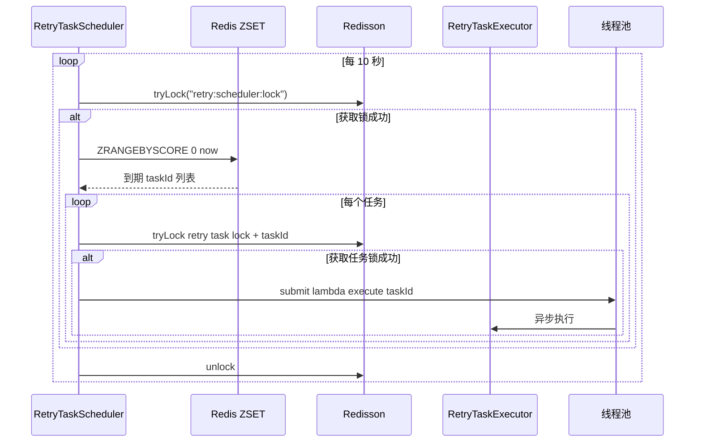

### 执行器（核心逻辑）

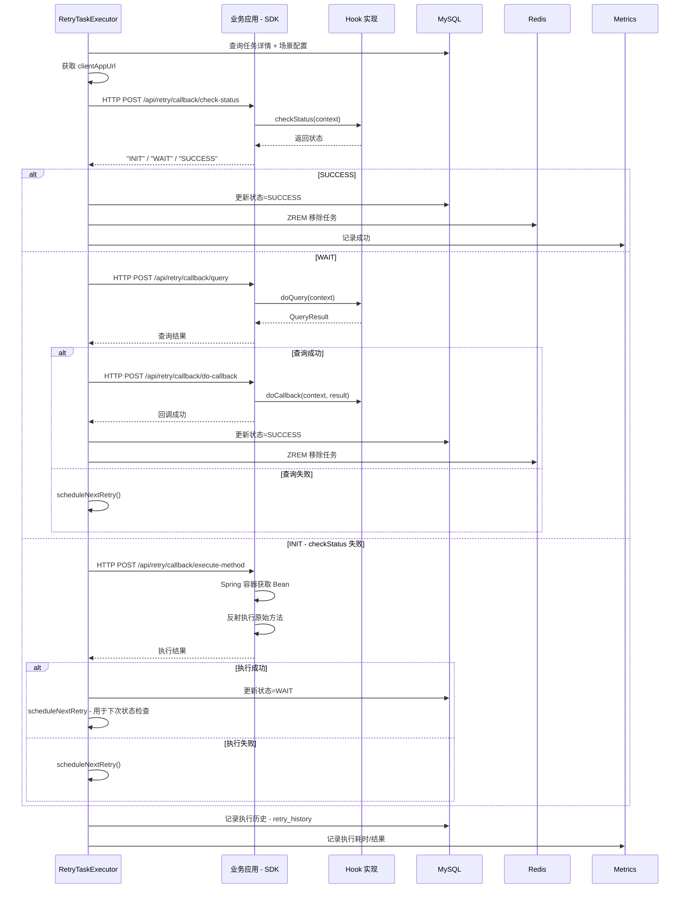

### scheduleNextRetry 逻辑

```
① 递增 retry_count
② 判断 retry_count >= max_retry_count?
   ├─ 是 → handleTaskFailure()
   │       ├─ 更新状态 = FAILED
   │       ├─ ZREM 移除任务
   │       └─ 移入 failed_task 表
   └─ 否 → 计算下次重试时间
           ├─ retry_intervals = "1,5,10,30"
           ├─ 取第 retry_count 个间隔 × 60 秒
           └─ 更新 DB + ZADD 延时队列
```

### DB 兜底调度器

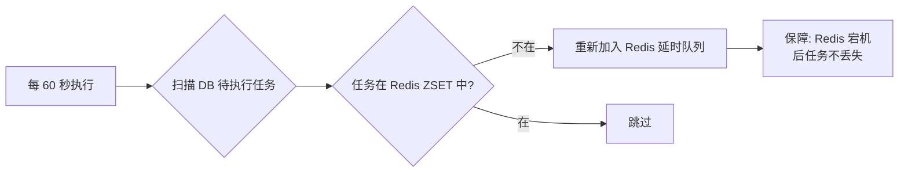

---

## 数据模型

### ER 图

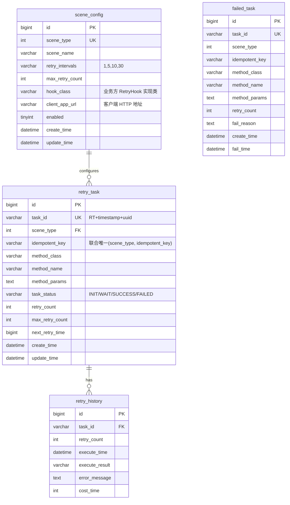

### 核心 SQL

```sql
-- 幂等性保证
UNIQUE KEY uk_scene_idempotent (scene_type, idempotent_key)

-- 待执行任务扫描
INDEX idx_status_next_time (task_status, next_retry_time)
```

---

## 部署架构

### 独立部署

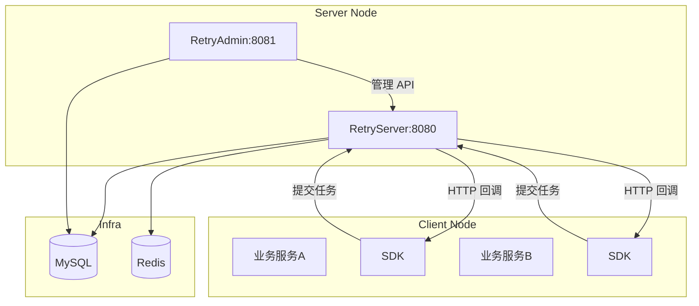

### 集群部署

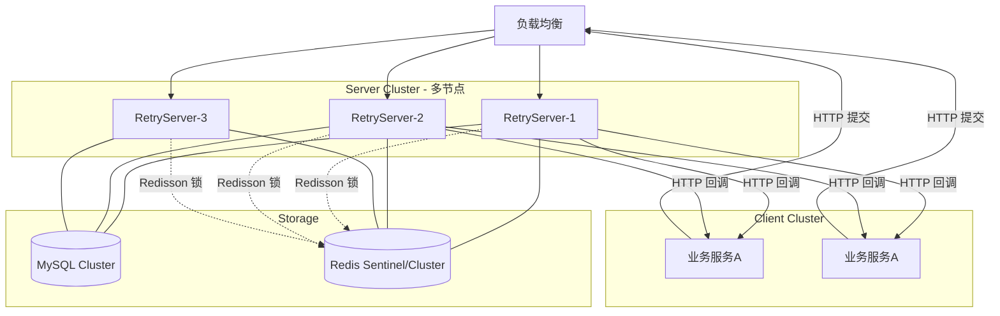

---

## 技术决策

### 1. 为什么从本地反射改为远程 HTTP 回调？

**旧方案问题**：
- 服务端通过 `applicationContext.getBean()` + `ReflectionInvoker` 调用业务代码
- 业务 Hook 接口定义在 server 包中，业务方需要依赖 server
- 反射调用无超时机制，业务方法卡死会阻塞 server 线程

**新方案优势**：
- 服务端零依赖业务代码（只需知道 client URL）
- 5 秒连接超时 + 10 秒读取超时，完美隔离
- 任何语言/框架都可对接（只需实现 4 个 HTTP 端点）
- 业务方独立维护 Hook，部署在自有进程中

### 2. 为什么选择 Redis ZSET 而不是 MQ？

**当前选择 ZSET**：
- 部署简单，大多数项目已有 Redis
- ZSET 天然支持延时队列（score = 执行时间戳）
- 性能足够（单机 10 万 QPS+），运维成本低

**DDB 兜底**：`DatabaseFallbackScheduler` 每 60 秒扫描 DB 中待执行但 Redis 中不存在的任务，确保不丢任务。

**后期可迁移**：当任务量达百万级，可引入 RocketMQ 延时消息替代 ZSET。

### 3. 幂等性设计

`(scene_type, idempotent_key)` 联合唯一索引保证任务不被重复创建。并发场景下 `DuplicateKeyException` 被优雅捕获，返回已存在的任务 ID。

### 4. 客户端 URL 配置机制

每个场景独立配置 `client_app_url`，支持：
- 同一业务系统的不同模块注册不同场景
- 多实例部署时，URL 可指向负载均衡
- 场景级别故障隔离

### 5. 监控与告警

Micrometer + Prometheus 埋点：

| 指标 | 类型 | 粒度 |
|------|------|------|
| `retry.tasks.submitted.total` | Counter | 场景类型 |
| `retry.tasks.executed.total` | Counter | 场景类型 + 结果 |
| `retry.tasks.execution.duration` | Timer | 场景类型 |
| `retry.active.tasks.count` | Gauge | - |
| `retry.failed.tasks.count` | Gauge | - |

---

## 当前缺失（待改进）

| 类别 | 缺失项 | 优先级 |
|------|--------|--------|
| **告警** | 告警通道只留了接口，没有邮件/钉钉/企微实际实现 | 高 |
| **入口** | Spring AOP 仍依赖 Spring，未替换为 ByteBuddy 零侵入 Agent | 中 |
| **系统配置** | admin 的系统配置页是占位符 | 中 |
| **文档** | SDK 使用文档、快速入门示例、接入指引 | 高 |
| **测试** | 集成测试单测已建，覆盖率目标未验证 | 中 |
| **MQ 迁移** | 未实现 RocketMQ 延时消息适配器 | 低 |
| **Trace** | 未实现完整的调用链追踪 | 低 |

---

## 配置参考

### server/application.yml

```yaml
server:
  port: 8080

spring:
  datasource:
    url: jdbc:mysql://localhost:3306/retry_platform
    username: root
    password: password
  redis:
    host: localhost
    port: 6379
    redisson:
      config: classpath:redisson.yml

retry:
  scheduler:
    scan-interval: 10000     # 扫描间隔(ms)
    batch-size: 100           # 每次处理任务数
    fallback-interval: 60000  # DB 兜底扫描间隔(ms)
  executor:
    core-pool-size: 10
    max-pool-size: 50
    queue-capacity: 1000
    connect-timeout: 5000     # HTTP 连接超时
    read-timeout: 10000       # HTTP 读取超时
```

### client-sdk/application.yml

```yaml
retry:
  client:
    server-url: http://localhost:8080
    enabled: true
    dev-mode: false
    connect-timeout: 5000
    read-timeout: 10000
```

### admin/application.yml

```yaml
server:
  port: 8081

spring:
  datasource:
    url: jdbc:mysql://localhost:3306/retry_platform
    username: root
    password: password
  redis:
    host: localhost
    port: 6379
```
