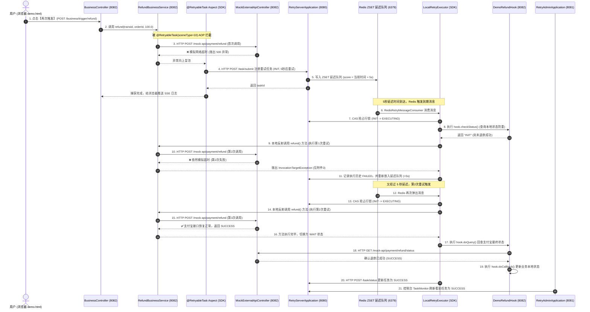

# ElecCloud 分布式重试平台核心架构与全链路流转详解

---

## 目录
1. [方法参数类型支持与反射机制说明](#1-方法参数类型支持与反射机制说明)
2. [附件3异常分析（InvocationTargetException 是否正常）](#2-附件3异常分析invocationtargetexception-是否正常)
3. [电商退款 Demo 全链路调用架构与各组件对应关系](#3-电商退款-demo-全链路调用架构与各组件对应关系)
4. [核心数据表与关键字段说明](#4-核心数据表与关键字段说明)
5. [重试平台各模块清理与精简说明](#5-重试平台各模块清理与精简说明)

---

## 1. 方法参数类型支持与反射机制说明

### 1.1 `method_param_types` 是怎么来的？需要人工配置吗？
* **完全不需要人工配置**。
* 当业务方法被打上 `@RetryableTask` 注解并被调用时，SDK 的 Spring AOP 切面（[`RetryableTaskAspect`](file:///d:/workspace/mine/eleccloud/retry-client-sdk/src/main/java/com/retry/platform/client/aspect/RetryableTaskAspect.java)）会通过 `MethodSignature.getParameterTypes()` **在运行时动态提取入参类型全类名**（例如 `java.lang.String,java.lang.String,java.lang.Double`），并自动随任务提交给服务端入库。

### 1.2 为什么要存 `method_param_types`？
* Java 允许**方法重载（Overload）**（即同名方法，但入参类型不同，如 `refund(String, Double)` 和 `refund(RefundRequestDTO)`）。
* 平台在未来驱动重试执行反射时，为了在 `Class` 中**100% 精确匹配**到被拦截的具体重载方法，必须依据参数类型签名进行定位。

### 1.3 是否支持复杂自定义类型（POJO / DTO）？
* **完全支持**！
* SDK 的 [`LocalRetryExecutor.java`](file:///d:/workspace/mine/eleccloud/retry-client-sdk/src/main/java/com/retry/platform/client/executor/LocalRetryExecutor.java) 中内置了基于 Jackson 的类型转换引擎：
  * **基础类型及包装类**：`int/Integer`, `long/Long`, `double/Double`, `String`, `boolean/Boolean` 等自动安全强转。
  * **自定义复合对象**：如果业务方法入参是自定义类 `public void refund(RefundDTO req)`，AOP 会将 DTO 序列化为 JSON 存入 `method_params`。在本地重试还原入参时，SDK 会通过 `objectMapper.readValue(json, targetType)` 自动反序列化为真实的 `RefundDTO` 实例传入方法。

---

## 2. 附件3异常分析（InvocationTargetException 是否正常？）

### 结论：100% 符合预期！这是模拟重试的核心验证逻辑。

### 深度剖析：
1. **为什么抛出 `InvocationTargetException`？**
   * 在 Java 中，使用反射 `Method.invoke(targetBean, args)` 调用一个方法时，**只要被调用的业务方法内部抛出了任何异常（例如 RuntimeException、网络超时、HTTP 500 等），反射框架都会统一将其包装成 `InvocationTargetException` 抛出**。
2. **为什么业务方法会抛出异常？**
   * 演示代码中的下游第三方接口 [`MockExternalApiController.java`](file:///d:/workspace/mine/eleccloud/retry-example/src/main/java/com/retry/platform/example/controller/MockExternalApiController.java) 默认配置了 `failTimes = 2`（前 2 次调用模拟支付宝网络超时，抛出 500 异常）。
   * 第 1 次（首次调用）：业务方抛出超时异常，AOP 捕获，向重试平台注册任务（状态 `INIT`）。
   * 第 2 次（第 1 次重试，即附件3断点处）：SDK 反射再次调用支付宝，由于模拟未达到 3 次，支付宝接口依然抛出异常，反射捕获到 `InvocationTargetException`，将本次重试历史记录为 `FAILED`（错误信息为 `e.getCause().getMessage()` 即“支付宝网关连接超时”），并计算下一次延时再次调度！
   * 第 3 次（第 2 次重试）：支付宝接口达到恢复阈值返回 HTTP 200 成功，方法正常返回，任务状态推进为 `WAIT` -> `SUCCESS`。

---

## 3. 电商退款 Demo 全链路调用架构与各组件对应关系

下面以 **场景1：电商退款（注解模式）** 为例，完整展示从前端点击到最终成功的每一个类、接口、消息与数据流向：

---

### 各类与组件职责速查表：

| 组件名称 | 所属模块/端口 | 角色与核心职责 |
| :--- | :--- | :--- |
| **`demo.html`** | 前端静态页面 (8082) | 演示交互界面，发起退款并监听 SSE 实时推送日志。 |
| **`BusinessController`** | `retry-example` (8082) | 模拟业务系统的 API 入口，响应页面按钮点击。 |
| **`RefundBusinessService`** | `retry-example` (8082) | **核心业务类**：包含实际退款逻辑，标注了 `@RetryableTask` 注解。 |
| **`MockExternalApiController`** | `retry-example` (8082) | **下游模拟器**：扮演外部支付宝/微信网关角色，内置前 N 次超时的逻辑。 |
| **`DemoRefundHook`** | `retry-example` (8082) | **重试钩子实现**：业务方自定义的重试状态检查与回调接口（实现 `RetryHook`）。 |
| **`RetryableTaskAspect`** | `retry-client-sdk` | **SDK AOP切面**：自动拦截异常、提取方法参数和参数类型签名，自动向平台提交任务。 |
| **`LocalRetryExecutor`** | `retry-client-sdk` | **本地重试状态机引擎**：消费延迟消息、还原入参、反射驱动本地业务重试、调用 Hook。 |
| **`RedisRetryMessageConsumer`** | `retry-client-sdk` | **客户端延时队列消费者**：监听 Redis ZSET，到期弹出任务并提交到本地线程池执行。 |
| **`RetryTaskController`** | `retry-server` (8080) | **服务端调度网关**：接收 SDK 提交任务、更新状态、记录执行历史、提供 CAS 锁控制。 |
| **`TaskMonitor.vue`** | `retry-admin` (8081) | **运维控制台**：可视化监控任务状态、执行次数、耗时与时间轴轨迹。 |

---

## 4. 核心数据表与关键字段说明

### 4.1 任务表 `retry_task`
| 字段 | 类型 | 说明 | 来源 |
| :--- | :--- | :--- | :--- |
| `task_id` | VARCHAR | 任务唯一标识（如 `RT17874094...`） | 服务端生成 |
| `scene_type` | INT | 场景类型（10: 电商退款, 11: 酒店结算, 12: 库存同步） | 注解 `@RetryableTask(sceneType=10)` |
| `idempotent_key`| VARCHAR | 业务幂等键（如 `RFD_89E0CAAF`） | AOP 从方法入参提取（SpEL `#transId`） |
| `method_class` | VARCHAR | 业务类的全限定名 (`RefundBusinessService`) | AOP 反射获取 |
| `method_name` | VARCHAR | 被调用的业务方法名 (`refund`) | AOP 反射获取 |
| `method_params`| TEXT | 入参 JSON Payload (`{"transId":"...","orderId":"...","amount":100.0}`) | AOP 提取并序列化 |
| `hook_class` | VARCHAR | 绑定的 Hook 钩子全类名 (`DemoRefundHook`) | 服务端根据 `scene_type` 自动关联 |
| `method_param_types` | VARCHAR | 参数类型列表 (`java.lang.String,java.lang.String,java.lang.Double`) | AOP 自动提取（用于重载精确定位） |
| `task_status` | VARCHAR | 状态：`INIT`(就绪) / `EXECUTING`(执行中) / `WAIT`(等待回查) / `SUCCESS`(成功) / `FAILED`(失败) | 状态机流转 |
| `retry_count` | INT | 已重试次数 | 每次重试自增 |
| `next_retry_time`| BIGINT | 下次重试时间戳（毫秒） | 策略引擎按退避规则计算 |

---

## 5. 重试平台各模块清理与精简说明

为了消除混淆，已对代码库中的历史冗余类完成了全面清理：
1. **已删除废弃类**：
   * `DemoPageController.java`（旧版重复的 demo-api 控制器，已删除）
   * `RefundController.java`（旧版独立的退款测试控制器，已删除）
2. **职责清晰划分**：
   * 业务演示入口统一收敛到 [`BusinessController.java`](file:///d:/workspace/mine/eleccloud/retry-example/src/main/java/com/retry/platform/example/controller/BusinessController.java) (`/business/**`)。
   * 下游模拟接口统一收敛到 [`MockExternalApiController.java`](file:///d:/workspace/mine/eleccloud/retry-example/src/main/java/com/retry/platform/example/controller/MockExternalApiController.java) (`/mock-api/**`)。
   * 8080 服务端与 8081 控制台已配置 `retry.client.consumer-enabled: false`，彻底杜绝了服务端误抢消费的问题。
