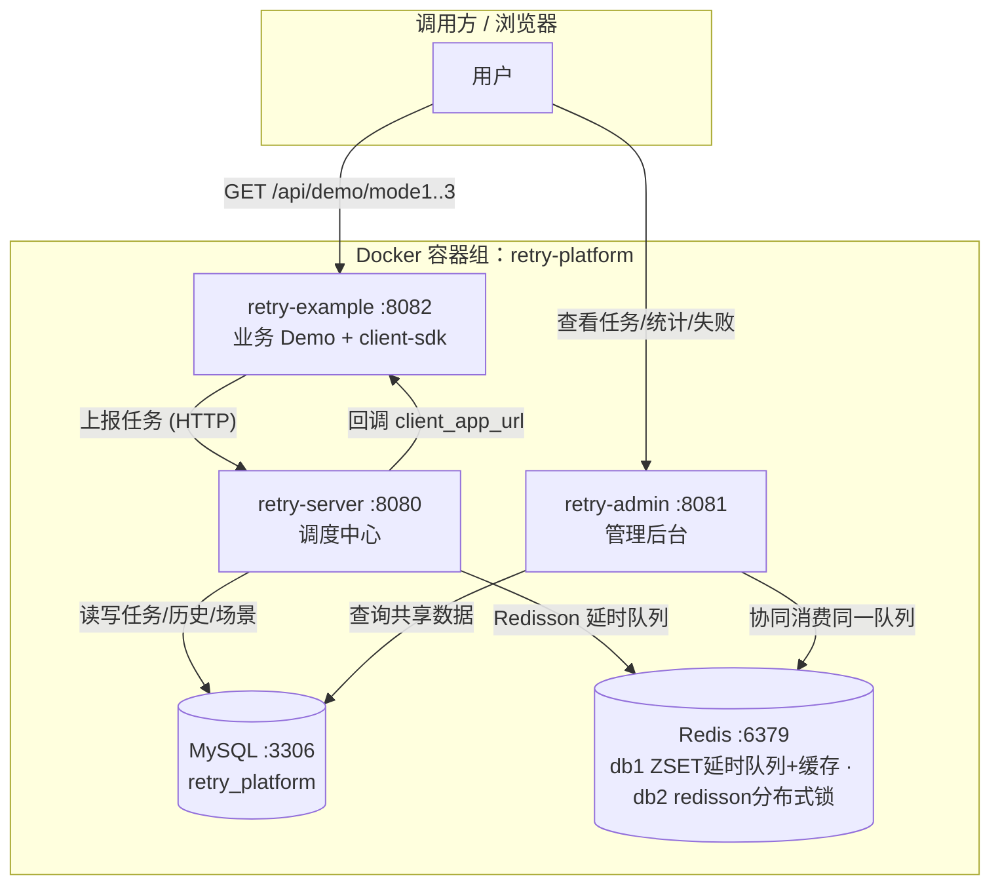
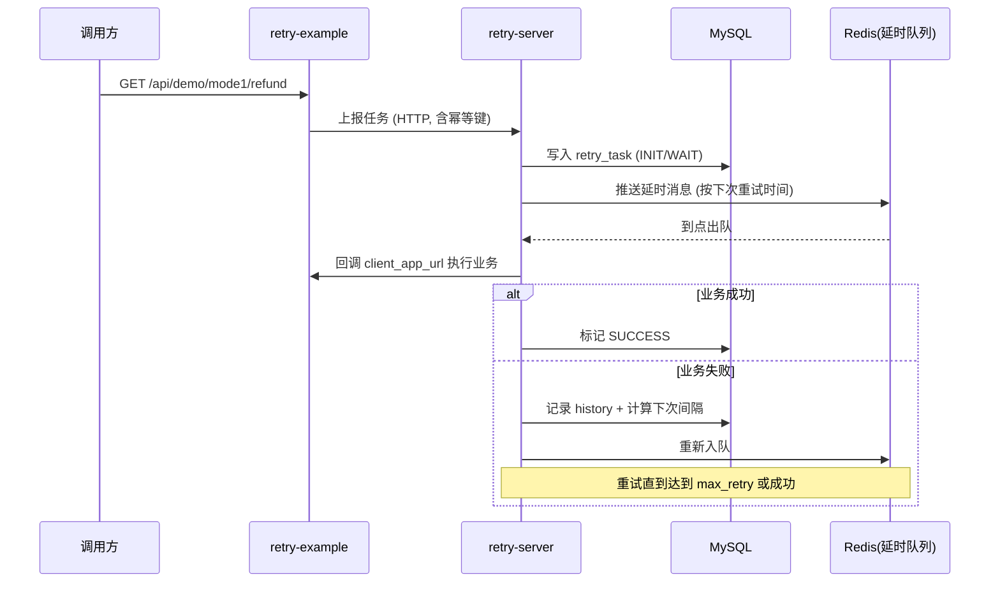

# 智擎分布式重试平台（retry-platform）部署与验证报告

> 编写日期：2026-07-13
> 适用范围：本地 Docker 演示环境（非生产）
> 项目路径：`D:\Workspace\mine\github\eleccloud`

---

## 1. 概述

本项目是一个**分布式重试调度平台**的端到端演示，包含 4 个自研服务 + 2 个中间件，全部以 Docker 容器形式运行在一个名为 **`retry-platform`** 的 Compose 项目（Portainer/Docker Desktop 中归为同一组）下，避免容器散落在最外层造成管理混乱。

| 维度 | 结论 |
|---|---|
| 中间件 | 仅 **MySQL 8.0** + **Redis 6**（example 作为 demo 不直连数据库，只通过 HTTP 调 server） |
| 服务数 | 5 个容器（mysql / redis / server / example / admin） |
| 编排方式 | `docker-compose -p retry-platform -f docker-compose.local.yml up -d --build` |
| 对外端口 | server 8080 / example 8082 / admin 8081 / mysql 3306 / redis 6379 |
| 鉴权 | **无**（admin 后台与所有 API 直接开放，仅限本地演示） |

---

## 2. 部署架构

### 2.1 容器组总览



### 2.2 容器清单

| 组件 | 容器名 | 宿主端口 | 容器内访问地址 | 依赖 | 角色 |
|---|---|---|---|---|---|
| **retry-server** | `retry-platform-server` | 8080 | `retry-server:8080` | mysql, redis (healthy) | 调度中心：落库、扫描、回调执行 |
| **retry-example** | `retry-platform-example` | 8082 | `retry-example:8082` | retry-server | 业务 Demo + 客户端 SDK 切面 |
| **retry-admin** | `retry-platform-admin` | 8081 | `retry-admin:8081` | mysql, redis (healthy) | 管理后台（Vue 静态页 + Spring Boot 查询） |
| **mysql** | `retry-platform-mysql` | 3306 | `mysql:3306` | — | 关系型存储 |
| **redis** | `retry-platform-redis` | 6379 | `redis:6379` | — | 缓存 / 分布式锁 / 延时队列 |

> 所有容器通过 Compose 默认网络 `retry-platform_default` 互联，互相用**服务名**（mysql / redis / retry-server / retry-example / retry-admin）做 DNS 解析。

### 2.3 启动 / 停止 / 清理命令

```bash
# 进入项目根目录
cd D:/Workspace/mine/github/eleccloud

# 启动（构建镜像并后台运行，归入 retry-platform 组）
docker-compose -p retry-platform -f docker-compose.local.yml up -d --build

# 查看整组容器状态
docker ps --filter "label=com.docker.compose.project=retry-platform"

# 查看某服务日志
docker logs -f retry-platform-server
docker logs -f retry-platform-admin

# 停止并移除容器（保留 MySQL 数据卷，下次启动数据还在）
docker-compose -p retry-platform -f docker-compose.local.yml down

# 彻底清理（连同 MySQL 数据卷一起删除，数据清空）
docker-compose -p retry-platform -f docker-compose.local.yml down -v
```

### 2.4 配置文件挂载关系

| 文件 | 挂载到 | 作用 |
|---|---|---|
| `db/init.sql` | `retry-platform-mysql:/docker-entrypoint-initdb.d/init.sql` | 首次启动自动建表 + 预置 3 个场景配置 |
| `retry-server-docker.yml` | `retry-platform-server:/app/config/retry-server-docker.yml` | 注入 DB/Redis 连接（通过 `--spring.config.additional-location`） |
| `retry-admin-docker.yml` | `retry-platform-admin:/app/config/retry-admin-docker.yml` | 同上，admin 与 server 配置一致 |
| （example 不挂配置） | — | 用仓库内 `application.yml` + 环境变量 `RETRY_CLIENT_SERVER_URL=http://retry-server:8080` 覆盖 |

> 设计要点：容器专属配置通过 `additional-location` 注入，**不修改仓库源码里的 `application.yml`**，源码在云/本地环境仍可用各自的配置运行。

---

## 3. 中间件清单（账号 / 密码 / 连接串）

### 3.1 MySQL

| 项 | 值 |
|---|---|
| 镜像 | `mysql:8.0` |
| 账号 | **`root`** |
| 密码 | **`password`** |
| 数据库名 | **`retry_platform`** |
| 字符集 | `utf8mb4 / utf8mb4_unicode_ci` |
| 端口 | 宿主 `3306` ↔ 容器 `3306` |
| 持久化 | 数据卷 `retry-platform-mysql-data` |
| 连接串（容器内） | `jdbc:mysql://mysql:3306/retry_platform?useUnicode=true&characterEncoding=utf-8&allowMultiQueries=true&rewriteBatchedStatements=true&useSSL=false&allowPublicKeyRetrieval=true&serverTimezone=GMT%2B8` |

**核心表结构**：
- `retry_task` —— 重试任务主表（状态：`INIT/WAIT/SUCCESS/FAILED`）
- `retry_history` —— 每次执行的历史记录
- `scene_config` —— 场景配置（退避策略、间隔、最大重试、回调 URL）
- `failed_task` —— 最终失败落库表

**预置 3 个场景**（来自 `db/init.sql`）：

| scene_type | 场景 | 退避策略 | 间隔 | 最大重试 | 回调地址 |
|---|---|---|---|---|---|
| 1 | 电商退款 | CUSTOM | 1,5,10,30 分钟 | 4 | `http://retry-example:8082` |
| 2 | 酒店结算 | LINEAR（base=2） | 2,4,6,8,10 分钟 | 5 | `http://retry-example:8082` |
| 3 | 库存同步 | EXPONENTIAL（base=1） | 1,2,4,8,16 分钟 | 5 | `http://retry-example:8082` |

### 3.2 Redis

| 项 | 值 |
|---|---|
| 镜像 | `redis:6-alpine` |
| 密码 | **无** |
| 端口 | 宿主 `6379` ↔ 容器 `6379` |
| `database=1` | Spring `RedisTemplate`：**ZSET 延时队列** `retry:delay:queue`（member=taskId, score=执行时间戳）+ 缓存 |
| `database=2` | **Redisson 仅用于分布式锁**（`DistributedLockUtil`），**不存队列** |
| 连接串（RedisTemplate） | `redis://redis:6379`（database 1，**延时队列实际所在**） |

> 关键点：调度中心依赖 **Redisson 的 `RBlockingQueue` 延时队列**（在 db2）。该队列是**分布式阻塞队列**，`server` 与 `admin` 都引入了 server 包、都作为消费者，**同一条消息只会被一个实例取到**，不会重复消费——这正是平台的多实例水平扩展设计。

### 3.3 应用层账号

- **无登录鉴权**：server / example / admin 三个 Web 服务均不校验账号密码，admin 后台（`http://localhost:8081`）直接开放访问。本地演示无所谓，生产必须加网关鉴权。

---

## 4. 系统架构

### 4.1 组件职责

| 组件 | 技术 | 职责 |
|---|---|---|
| **retry-client-sdk** | Java / Spring AOP | 提供 `@RetryableTask` 注解切面，业务方法标注后即具备重试能力；通过 SpEL（如 `#orderId`）生成幂等键 |
| **retry-example** | Spring Boot 2.7 + Java 17（target 1.8） | 演示业务：退款 / 结算 / 库存三个服务，演示三种接入模式 |
| **retry-server** | Spring Boot 2.7 + Redisson | 调度中心：接收任务、落库、基于延时队列触发执行、回调业务方 HTTP 端点、记录历史 |
| **retry-admin** | Spring Boot 2.7 + 内嵌 Vue 前端 | 管理后台：查询任务列表 / 统计 / 失败任务 / 场景配置（只读为主） |

### 4.2 三种重试模式（已覆盖演示）

| 模式 | 接入方式 | Demo 端点 | 特点 |
|---|---|---|---|
| 模式 1 · 注解模式 | `@RetryableTask` + CUSTOM 间隔 | `/api/demo/mode1/refund` | 业务方法直接标注，AOP 自动拦截失败并重试 |
| 模式 2 · API 模式 | `RetryClient.submit()` + LINEAR 间隔 | `/api/demo/mode2/settlement` | 代码手动提交任务，适合非注解场景 |
| 模式 3 · 预提交模式 | `preSubmit=true` + EXPONENTIAL 间隔 | `/api/demo/mode3/inventory` | 执行前预注册，成功即终态，幂等安全 |

### 4.3 端到端数据流



### 4.4 分布式协同说明

- `server` 与 `admin` **共享同一个 MySQL 库和同一个 Redis ZSET 延时队列**，admin 本质是"带了后台界面的第二个 server 实例"，也会启动同一套调度器，但**靠 redisson 分布式锁保证同一批任务只被一个实例处理**。
- 多实例防重机制：**ZSET 定时拉取到期任务 + redisson 分布式锁抢锁**（不是阻塞队列的出队语义），可水平扩展更多 `server`/`admin` 实例。

---

## 5. 如何验证（端到端）

### 5.1 前置检查：容器与健康

```bash
# 1) 确认 5 个容器都在 retry-platform 组且状态正常
docker ps --filter "label=com.docker.compose.project=retry-platform" \
  --format "table {{.Names}}\t{{.Status}}\t{{.Ports}}"
```
预期：mysql / redis 为 `healthy`；server / admin 至少 `Up`（admin 带 healthy），example `Up`。

```bash
# 2) 确认 admin 连上数据源（日志里应出现 "Loading scene config" / Redisson 初始化成功）
docker logs retry-platform-admin 2>&1 | grep -iE "scene|redisson|Started" | tail -10
```

### 5.2 触发三种场景

```bash
# 模式1：电商退款（注解模式，会刻意抛异常后重试）
curl "http://localhost:8082/api/demo/mode1/refund"

# 模式2：酒店结算（API 模式）
curl "http://localhost:8082/api/demo/mode2/settlement"

# 模式3：库存同步（预提交模式，立即 SUCCESS）
curl "http://localhost:8082/api/demo/mode3/inventory"

# 查看 example 本地任务状态
curl "http://localhost:8082/api/demo/status"
```

### 5.3 通过管理后台核查（推荐）

```bash
# 场景配置列表（应返回 3 条，clientAppUrl 都是 http://retry-example:8082）
curl "http://localhost:8081/api/scene/list"

# 仪表盘统计（success / failed / total 计数）
curl "http://localhost:8081/api/task/stats"

# 任务列表（最新任务在最前）
curl "http://localhost:8081/api/task/list?pageNum=1&pageSize=10"

# 失败任务列表（达到最大重试后才会落这里）
curl "http://localhost:8081/api/failed/list?pageNum=1&pageSize=10"
```
也可直接浏览器打开 **`http://localhost:8081`** 看可视化后台。

### 5.4 直接查数据库（最硬核验证）

```bash
docker exec retry-platform-mysql mysql -uroot -ppassword retry_platform \
  -e "SELECT task_id, scene_type, task_status, retry_count, next_retry_time FROM retry_task ORDER BY id DESC LIMIT 10;"

# 看重试历史
docker exec retry-platform-mysql mysql -uroot -ppassword retry_platform \
  -e "SELECT task_id, retry_count, execute_result, error_message FROM retry_history ORDER BY id DESC LIMIT 10;"
```

### 5.5 直接查 Redis 延时队列

```bash
# 队列长度（有等待重试的任务时 > 0）—— 注意队列在 db1
docker exec retry-platform-redis redis-cli -n 1 llen retry:delay:queue

# 看队列里待处理的 member（taskId，score 是执行时间戳；不要随便删）
docker exec retry-platform-redis redis-cli -n 1 zrange retry:delay:queue 0 -1 withscores
```

### 5.6 预期结果对照表

| 验证项 | 预期 |
|---|---|
| 容器状态 | 5 个容器均 `Up`，mysql/redis/server/admin 健康 |
| `scene/list` | 3 条场景，`clientAppUrl = http://retry-example:8082` |
| 模式 3 触发后 | `retry_task` 中对应记录 `task_status = SUCCESS`（预提交即成功） |
| 模式 1 / 2 触发后 | 立即出现 `FAILED_AS_EXPECTED` / 首轮失败记录，`retry_history` 有 `RETRY` 行；随后按分钟级间隔自动重试 |
| `retry:delay:queue` | 有等待中的消息（`llen > 0`），到点后出队被消费 |
| admin 与 example 数据一致 | admin 的 task 列表能查到 example 产生的任务（共享 DB） |

> ⚠️ **关于“为什么没立刻看到 SUCCESS”**：模式 1/2 是“失败后再重试”设计，退款最长需等待 1+5+10+30=46 分钟、结算最长 2+4+6+8+10=30 分钟才会跑完重试序列并置为 SUCCESS。这是**预期行为**，验证“提交成功 + 重试闭环已触发”即可，无需干等全程。

### 5.7 一键自检脚本（可复制）

```bash
echo "== containers ==" && docker ps --filter "label=com.docker.compose.project=retry-platform" --format "{{.Names}} {{.Status}}"
echo "== trigger ==" && curl -s "http://localhost:8082/api/demo/mode3/inventory"
echo "" && echo "== admin stats ==" && curl -s "http://localhost:8081/api/task/stats"
echo "" && echo "== queue len ==" && docker exec retry-platform-redis redis-cli -n 2 llen retry:delay:queue
```

---

## 6. 已知修复与注意事项（供二次部署参考）

### 6.1 编译 / 构建层面的关键修复
1. **retry-admin 编译失败（26 个找不到符号）**
   根因：`retry-server` 用 spring-boot 插件默认 `repackage`，主 artifact 被替换成 fat jar（类全部藏在 `BOOT-INF/classes/`），作为库依赖时 admin 编译期引用不到 `com.retry.platform.server.*`。
   修复：`retry-server/pom.xml` 加 `<classifier>exec</classifier>`，主 artifact 保留 thin jar 供依赖，fat jar 变 `retry-server-*-exec.jar`；同步改 `retry-server/Dockerfile` 的 `JAR_FILE`。
2. **Maven 本地仓库路径**：本机 `settings.xml` 指向一个不存在的仓库路径，构建时必须显式加 `-Dmaven.repo.local="C:/Users/27847/.m2/repository"`。

### 6.2 运行期的 5 个业务 Bug（已修复并验证）
- 缺少 `-parameters` 编译参数 → 参数名解析失败（已在父 pom 补 `<compilerArgs><arg>-parameters</arg></compilerArgs>`）
- `ArrayIndexOutOfBoundsException` → 幂等键匹配越界（ParameterExtractor 去掉前导 `#` 后匹配）
- AOP 切面对**基本类型返回 null** → 拆箱 NPE（改为返回类型零值，如 boolean→false）
- `client_app_url` 写死 `localhost:8082` → 容器内无法回调（已改为 `http://retry-example:8082`）
- PRE_SUBMIT 竞态 → 初始化写状态前重查 DB，已 SUCCESS 则跳过降级（RetryTaskExecutor.handleInit）

### 6.3 待清理项（非阻塞）
- `retry-admin/src/main/java/.../agentscope/{Test,Mem0Test}.java` 是实验性代码（依赖 `io.agentscope`），能编译但**不被 Spring 扫描**、不影响运行，却会撑大镜像。提交/打包前建议删除。

### 6.4 本地演示的硬编码安全项（生产必须改造）
- MySQL 密码 `password`、Redis 无密码、admin 无鉴权，全部写在 `docker-compose.local.yml` 与 `*-docker.yml`。
- 生产应改为：密钥外置（env / Docker secret / 配置中心）、admin 加网关 + 登录、client_app_url 配置化。

---

## 7. 一句话总结

本地 `retry-platform` 组 = **1 个调度中心（server）+ 1 个业务 Demo（example）+ 1 个管理后台（admin）+ MySQL + Redis**，通过 `docker-compose -p retry-platform up -d --build` 一条命令拉起；验证时触发 example 的三个 demo 端点，再到 admin（`localhost:8081`）或直查 MySQL/Redis 核对任务状态与延时队列即可。
